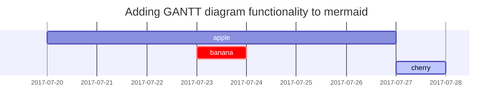

> 깃허브 블로그를 만들어야지.. 만들어야지.. 하고 계~속 미루다가, 올해는 계획표도 짜고 열심히 살아보자 싶어서 기록용으로 제일 중요한 깃허브 블로그를 만들어 보았다. 기념의 첫 포스팅!
> 
> 사실 블로그 만들고 테마 입히는 걸 되게 얕보고 있었는데... 이번에 Chirpy 테마를 적용하면서 이틀동안 시행착오를 너무 많이 겪어서 혹시나 이 글을 보게 되신 분은 나와 같은 오류로 헤매지 않았으면 하여 글을 작성한다.   
> (그런데 구글링 계속 하다보니 다른 jekyll 테마는 잘 적용되는데 유독 이 테마가 적용 시 오류가 많다고 한다.)
> 
> 그래도 성공적으로 적용했으니 된 거 아닐까? 추후엔 코멘트 기능도 달고, jekyll 어드민도 사용 가능하게 넣어보려고 한다!
> 
> *MacOS 기준으로 작성


## Chirpy 테마 적용하기
<hr/>

무엇보다 중요한 게 있다. 바로 [**공식 문서**](https://chirpy.cotes.page/posts/getting-started/)를 참고하여 테마를 적용하는 것이다..!    
jekyll 설치, ruby 설치 등은 다른 많은 블로그에서 상세히 설명하고 있으니 따로 적지 않겠다.
이 글은 공식 문서를 참고하다가, 오류가 발생했을 때 만약 아래의 내용과 동일한 오류라면 참고하면 좋을 것 같다.

## ruby 버전 문제
<hr />

항상 무언가를 설치할 때 혹시 모를 버그가 있을 수 있기 때문에 최신버전은 기피해야 한다. 하지만 설마 괜찮겠지 하고 설치했던 게 독이 되었던.. ruby 버전으로 인해 발생한 오류가 있었다.   
현재 날짜 기준(24.02.14) ruby의 제일 최신 버전이 3.3.0 인데, 이는 2개월(23.12) 전에 등록된 버전이다.   
ruby의 버전 문제로 계속 발생했던 오류는 다음과 같다.

```
An error occurred while installing google-protobuf (3.25.2), and Bundler cannot
continue.

In Gemfile:
  jekyll-theme-chirpy was resolved to 6.4.2, which depends on
    jekyll-archives was resolved to 2.2.1, which depends on
      jekyll was resolved to 4.3.3, which depends on
        jekyll-sass-converter was resolved to 3.0.0, which depends on
          sass-embedded was resolved to 1.70.0, which depends on
            google-protobuf
Error: The process '/opt/hostedtoolcache/Ruby/3.2.2/x64/bin/bundle' failed with exit code 5
```
저 메세지로 구글링을 하면 pages-deploy.yml 파일의 ruby-version을 3.2로 바꾸라는 등의 내용이 나오는데, 나의 경우는 해결이 되지 않았다.   
사실 검색을 하면서도 설마 버전때문은 아니겠지 했었는데 ㅎㅎ   
3.1.3 버전으로 다운그레이드 하고 다시 bundle 을 적용했다.
```shell
$ rbenv install -l 
$ rbenv install 3.1.3
$ rbenv global 3.1.3
$ bundle update
```
계속 말썽을 부리던 Setup Ruby 단계를 무사히 성공했다.
> ruby 버전 다운그레이드 후 bundle update
{: .prompt-tip }

## bash tools/init 문제


This post is to show Markdown syntax rendering on [**Chirpy**](https://github.com/cotes2020/jekyll-theme-chirpy/fork), you can also use it as an example of writing. Now, let's start looking at text and typography.

## Headings

# H1 - heading
{: .mt-4 .mb-0 }

## H2 - heading
{: data-toc-skip='' .mt-4 .mb-0 }

### H3 - heading
{: data-toc-skip='' .mt-4 .mb-0 }

#### H4 - heading
{: data-toc-skip='' .mt-4 }

## Paragraph

Quisque egestas convallis ipsum, ut sollicitudin risus tincidunt a. Maecenas interdum malesuada egestas. Duis consectetur porta risus, sit amet vulputate urna facilisis ac. Phasellus semper dui non purus ultrices sodales. Aliquam ante lorem, ornare a feugiat ac, finibus nec mauris. Vivamus ut tristique nisi. Sed vel leo vulputate, efficitur risus non, posuere mi. Nullam tincidunt bibendum rutrum. Proin commodo ornare sapien. Vivamus interdum diam sed sapien blandit, sit amet aliquam risus mattis. Nullam arcu turpis, mollis quis laoreet at, placerat id nibh. Suspendisse venenatis eros eros.

## Lists

### Ordered list

1. Firstly
2. Secondly
3. Thirdly

### Unordered list

- Chapter
  + Section
    * Paragraph

### ToDo list

- [ ] Job
  + [x] Step 1
  + [x] Step 2
  + [ ] Step 3

### Description list

Sun
: the star around which the earth orbits

Moon
: the natural satellite of the earth, visible by reflected light from the sun

## Block Quote

> This line shows the _block quote_.

## Prompts

> An example showing the `tip` type prompt.
{: .prompt-tip }

> An example showing the `info` type prompt.
{: .prompt-info }

> An example showing the `warning` type prompt.
{: .prompt-warning }

> An example showing the `danger` type prompt.
{: .prompt-danger }

## Tables

| Company                      | Contact          | Country |
|:-----------------------------|:-----------------|--------:|
| Alfreds Futterkiste          | Maria Anders     | Germany |
| Island Trading               | Helen Bennett    | UK      |
| Magazzini Alimentari Riuniti | Giovanni Rovelli | Italy   |

## Links

<http://127.0.0.1:4000>

## Footnote

Click the hook will locate the footnote[^footnote], and here is another footnote[^fn-nth-2].

## Inline code

This is an example of `Inline Code`.

## Filepath

Here is the `/path/to/the/file.extend`{: .filepath}.

## Code blocks

### Common

```
This is a common code snippet, without syntax highlight and line number.
```

### Specific Language

```bash
if [ $? -ne 0 ]; then
  echo "The command was not successful.";
  #do the needful / exit
fi;
```

### Specific filename

```sass
@import
  "colors/light-typography",
  "colors/dark-typography";
```
{: file='_sass/jekyll-theme-chirpy.scss'}

## Mathematics

The mathematics powered by [**MathJax**](https://www.mathjax.org/):

$$
\begin{equation}
\sum_{n=1}^\infty 1/n^2 = \frac{\pi^2}{6}
\label{eq:series}
\end{equation}
$$

We can reference the equation as \eqref{eq:series}.

When $a \ne 0$, there are two solutions to $ax^2 + bx + c = 0$ and they are

$$ x = {-b \pm \sqrt{b^2-4ac} \over 2a} $$

## Mermaid SVG



## Images

### Default (with caption)

{: width="972" height="589" }
_Full screen width and center alignment_

### Left aligned

{: width="972" height="589" .w-75 .normal}

### Float to left

{: width="972" height="589" .w-50 .left}
Praesent maximus aliquam sapien. Sed vel neque in dolor pulvinar auctor. Maecenas pharetra, sem sit amet interdum posuere, tellus lacus eleifend magna, ac lobortis felis ipsum id sapien. Proin ornare rutrum metus, ac convallis diam volutpat sit amet. Phasellus volutpat, elit sit amet tincidunt mollis, felis mi scelerisque mauris, ut facilisis leo magna accumsan sapien. In rutrum vehicula nisl eget tempor. Nullam maximus ullamcorper libero non maximus. Integer ultricies velit id convallis varius. Praesent eu nisl eu urna finibus ultrices id nec ex. Mauris ac mattis quam. Fusce aliquam est nec sapien bibendum, vitae malesuada ligula condimentum.

### Float to right

{: width="972" height="589" .w-50 .right}
Praesent maximus aliquam sapien. Sed vel neque in dolor pulvinar auctor. Maecenas pharetra, sem sit amet interdum posuere, tellus lacus eleifend magna, ac lobortis felis ipsum id sapien. Proin ornare rutrum metus, ac convallis diam volutpat sit amet. Phasellus volutpat, elit sit amet tincidunt mollis, felis mi scelerisque mauris, ut facilisis leo magna accumsan sapien. In rutrum vehicula nisl eget tempor. Nullam maximus ullamcorper libero non maximus. Integer ultricies velit id convallis varius. Praesent eu nisl eu urna finibus ultrices id nec ex. Mauris ac mattis quam. Fusce aliquam est nec sapien bibendum, vitae malesuada ligula condimentum.

### Dark/Light mode & Shadow

The image below will toggle dark/light mode based on theme preference, notice it has shadows.

{: .light .w-75 .shadow .rounded-10 w='1212' h='668' }
{: .dark .w-75 .shadow .rounded-10 w='1212' h='668' }

## Video



## Reverse Footnote

[^footnote]: The footnote source
[^fn-nth-2]: The 2nd footnote source
